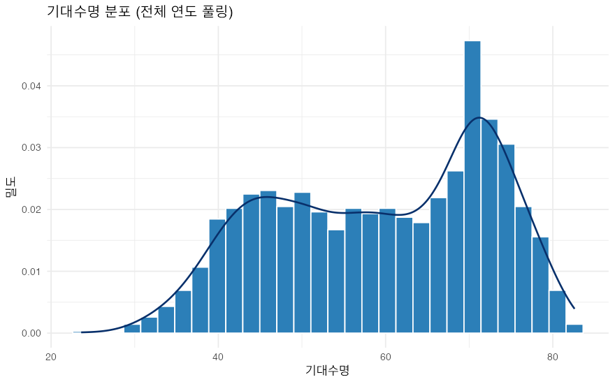
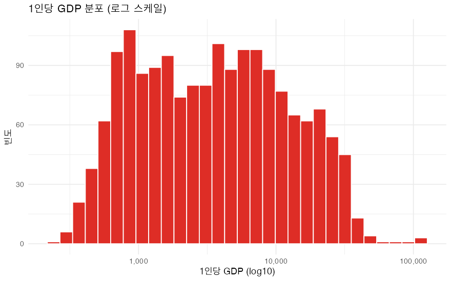
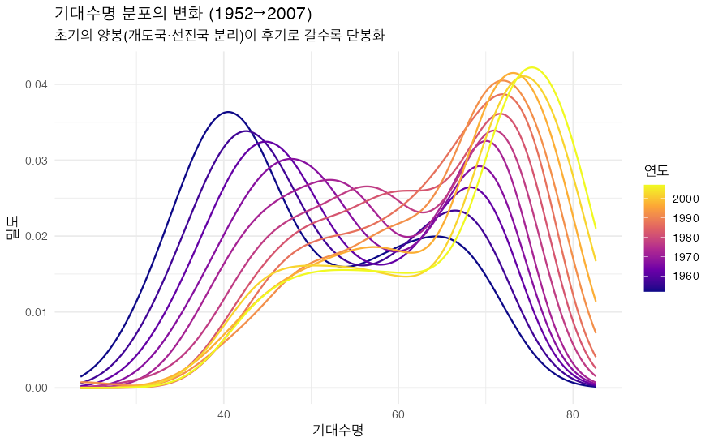
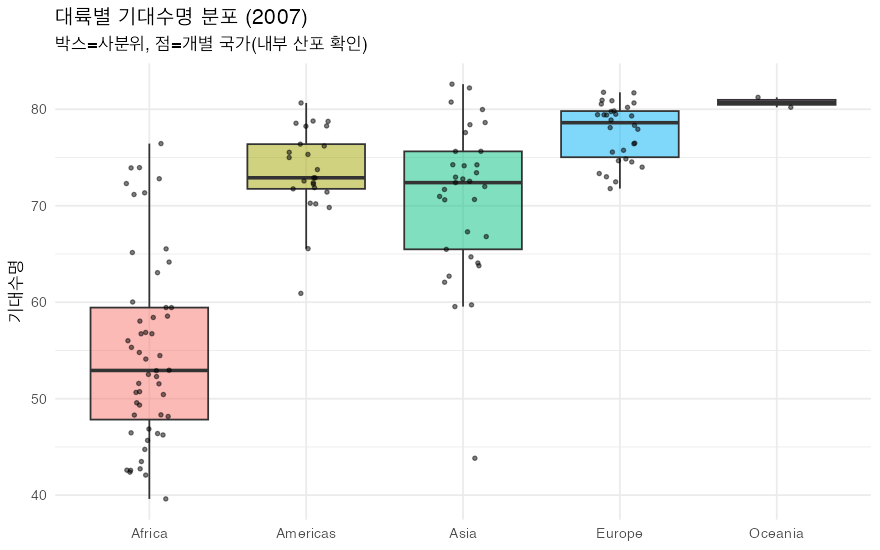
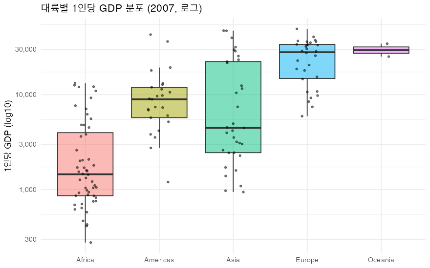
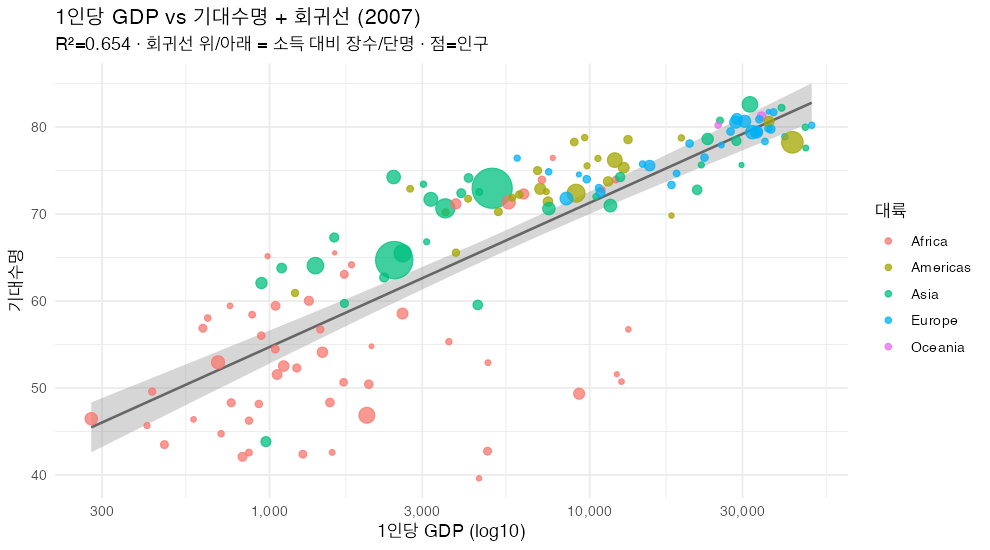
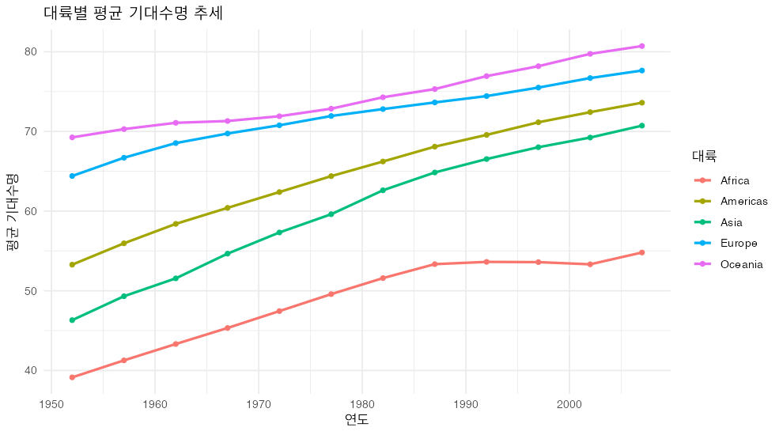
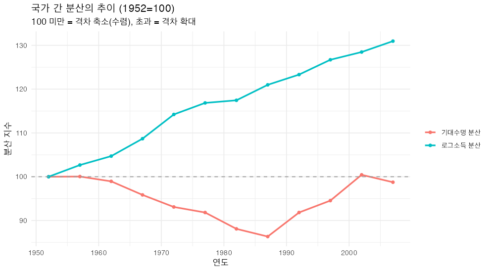
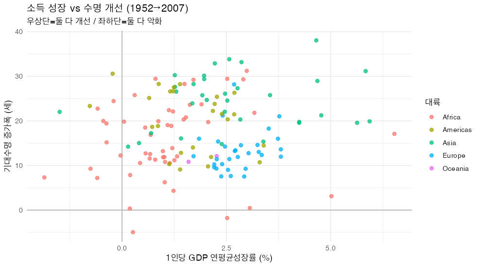

# Gapminder 탐색적 데이터 분석 (EDA)

> 생성: `eda.R` · 대상: `data/gapminder.csv` · 기간: 1952–2007 (12개 시점) · 단위: 국가×연도

본 보고서는 분포 → 관계 → 집단 비교 → 시간 추세 → 수렴 → 성장/충격 순으로 데이터를 탐색하며, 각 단계의 **방법론적 함정**을 함께 점검합니다.

## 0. 데이터 구조

| 항목 | 값 |
|------|-----|
| 관측치 | 1704 (142개국 × 12시점) |
| 결측치 | 0 |
| 변수 | lifeExp, pop, gdpPercap (+파생: totalGDP, logGdp) |
| 패널 | 완전 균형(국가별 12시점) |

## 1. 단변량 분포

왜도(skew)는 비대칭, 초과첨도(kurtosis)는 꼬리 두께를 나타냅니다. 0에 가까울수록 정규에 가깝습니다.

| 변수 | 중앙값 | 평균 | 표준편차 | 왜도 | 초과첨도 |
|------|------:|----:|--------:|----:|--------:|
| lifeExp | 60.7 | 59.5 | 12.9 | -0.25 | -1.13 |
| pop | 7,023,595.5 | 29,601,212.3 | 106,157,896.7 | 8.33 | 77.72 |
| gdpPercap | 3,531.8 | 7,215.3 | 9,857.5 | 3.85 | 27.43 |
| log10(pop) | 6.8 | 6.8 | 0.7 | 0.08 | 0.48 |
| log10(gdp) | 3.5 | 3.5 | 0.5 | 0.11 | -0.95 |

인구·GDP는 원본에서 강한 우편향(왜도 ≫ 0)이나, **로그 변환 후 왜도가 0 부근으로 정규화**됩니다. 따라서 이후 분석은 소득·인구에 로그 척도를 사용합니다.

*그림 1. 기대수명 분포 — 좌측 꼬리(개도국·충격)가 존재해 약한 좌편향*

*그림 2. 1인당 GDP — 로그 변환 시 근사적으로 대칭*

## 2. 기대수명 분포의 시간 변화

연도별 분포 형태 변화를 보면 단순 평균 상승 외에 **양봉(개도국/선진국 분리) → 단봉으로의 수렴** 여부를 읽을 수 있습니다.

*그림 3. 기대수명 분포의 연도별 이동 — 좌측 봉우리가 우측으로 흡수*

## 3. 대륙별 비교 — 중심과 내부 이질성 (2007)

중앙값만 보면 대륙 내부 편차를 놓칩니다. **변동계수(CV=표준편차/평균)**로 이질성을 함께 봅니다. CV가 클수록 같은 대륙 안에서도 국가 간 차이가 큽니다.

| 대륙 | 국가수 | 기대수명 중앙값 | 기대수명 CV | GDP 중앙값 | GDP CV |
|------|------:|--------------:|-----------:|----------:|------:|
| Africa | 52 | 52.9 | 0.176 | $1,452 | 1.171 |
| Americas | 25 | 72.9 | 0.060 | $8,948 | 0.883 |
| Asia | 33 | 72.4 | 0.113 | $4,471 | 1.135 |
| Europe | 30 | 78.6 | 0.038 | $28,054 | 0.471 |
| Oceania | 2 | 80.7 | 0.009 | $29,810 | 0.219 |

아프리카는 기대수명 CV가 가장 커서 '대륙=단일 집단' 가정이 가장 위험합니다 (보츠와나·리비아 vs 분쟁국의 공존).

*그림 4. 대륙별 기대수명 — 점으로 내부 산포 표시*

*그림 5. 대륙별 1인당 GDP — 아시아 내부 편차가 가장 큼*

## 4. 소득과 기대수명의 관계

### 4-1. 상관계수 — 풀링은 함정

전 연도를 섞은 **풀링 상관**은 시간 추세까지 흡수해 과대평가될 수 있습니다. 연도별로 끊어 보면 관계의 **안정성**을 확인할 수 있습니다.

- 풀링(전체): 원본 r=**0.584**, 로그 r=**0.808**

| 연도 | r( log10(GDP), 기대수명 ) |
|------|-------------------------:|
| 1952 | 0.748 |
| 1957 | 0.759 |
| 1962 | 0.771 |
| 1967 | 0.773 |
| 1972 | 0.789 |
| 1977 | 0.814 |
| 1982 | 0.846 |
| 1987 | 0.874 |
| 1992 | 0.856 |
| 1997 | 0.864 |
| 2002 | 0.825 |
| 2007 | 0.809 |

연도별 상관이 0.75~0.87 범위에서 안정적이므로, 로그소득–수명 관계는 시점과 무관하게 견고합니다. (풀링 r 0.808이 특정 연도에 의해 부풀려진 것이 아님)

### 4-2. 회귀 적합과 잔차 — 소득으로 설명되지 않는 국가

선형회귀 `기대수명 ~ log10(GDP)`의 결정계수 **R²=0.654** → 기대수명 분산의 약 65%가 소득만으로 설명됩니다. 나머지는 보건·제도·역사적 충격의 몫입니다. 잔차가 큰 국가는 *소득 대비* 특이 사례입니다.

**소득 대비 기대수명이 낮은 국가(음의 잔차)** — 산유국·HIV 피해국 등

| 국가 | 1인당 GDP | 실제 수명 | 잔차(세) |
|------|---------:|--------:|--------:|
| Swaziland | $4,513 | 39.6 | -25.9 |
| Angola | $4,797 | 42.7 | -23.3 |
| Botswana | $12,570 | 50.7 | -22.2 |
| South Africa | $9,270 | 49.3 | -21.4 |
| Equatorial Guinea | $12,154 | 51.6 | -21.1 |
| Gabon | $13,206 | 56.7 | -16.6 |

**소득 대비 기대수명이 높은 국가(양의 잔차)** — 보건 효율 우수

| 국가 | 1인당 GDP | 실제 수명 | 잔차(세) |
|------|---------:|--------:|--------:|
| Vietnam | $2,442 | 74.2 | +13.1 |
| Nicaragua | $2,749 | 72.9 | +10.9 |
| West Bank and Gaza | $3,025 | 73.4 | +10.7 |
| Comoros | $986 | 65.2 | +10.5 |
| Korea, Dem. Rep. | $1,593 | 67.3 | +9.2 |
| Syria | $4,185 | 74.1 | +9.1 |

*그림 6. 소득–수명 회귀와 이탈 국가*

## 5. 전세계 추세 — 단순평균 vs 인구가중평균

국가별 단순평균은 투발루와 중국을 동일 취급해 **실제 인류 경험을 왜곡**합니다. 인구가중평균을 병기하면 '평균적 국가' vs '평균적 사람'의 차이가 드러납니다.

| 연도 | 기대수명(단순) | 기대수명(인구가중) | GDP(단순) | GDP(인구가중) |
|------|-------------:|-----------------:|---------:|------------:|
| 1952 | 49.1 | 48.9 | $3,725 | $2,924 |
| 1957 | 51.5 | 52.1 | $4,299 | $3,339 |
| 1962 | 53.6 | 52.3 | $4,726 | $3,795 |
| 1967 | 55.7 | 57.0 | $5,484 | $4,428 |
| 1972 | 57.6 | 59.5 | $6,770 | $5,150 |
| 1977 | 59.6 | 61.2 | $7,313 | $5,679 |
| 1982 | 61.5 | 62.9 | $7,519 | $5,917 |
| 1987 | 63.2 | 64.4 | $7,901 | $6,423 |
| 1992 | 64.2 | 65.6 | $8,159 | $6,751 |
| 1997 | 65.0 | 66.8 | $9,090 | $7,435 |
| 2002 | 65.7 | 67.8 | $9,918 | $8,029 |
| 2007 | 67.0 | 68.9 | $11,680 | $9,296 |

2007년 기준 단순평균 기대수명이 인구가중보다 -1.9세 낮습니다 — 인구 대국(중국·인도)이 평균 부근에 있어 가중 시 끌려 내려갑니다. 단순평균만 보고하면 소국 다수의 성취에 치우칩니다.

*그림 7. 대륙별 기대수명 추세 — 아시아의 빠른 추격*

*그림 8. 대륙별 소득 추세 — 아프리카 정체 구간 확인*

## 6. 수렴 분석 (σ-convergence)

'격차가 줄고 있나'는 이 데이터의 핵심 질문입니다. 연도별로 국가 간 **표준편차(분산)**가 감소하면 수렴, 증가하면 양극화입니다. 척도가 다른 두 지표를 비교하기 위해 1952년을 100으로 지수화했습니다.

| 연도 | 기대수명 SD | 로그GDP SD | 기대수명 분산지수 | 로그GDP 분산지수 |
|------|----------:|----------:|----------------:|---------------:|
| 1952 | 12.23 | 0.450 | 100 | 100 |
| 1957 | 12.23 | 0.462 | 100 | 103 |
| 1962 | 12.10 | 0.471 | 99 | 105 |
| 1967 | 11.72 | 0.489 | 96 | 109 |
| 1972 | 11.38 | 0.514 | 93 | 114 |
| 1977 | 11.23 | 0.525 | 92 | 117 |
| 1982 | 10.77 | 0.528 | 88 | 117 |
| 1987 | 10.56 | 0.544 | 86 | 121 |
| 1992 | 11.23 | 0.555 | 92 | 123 |
| 1997 | 11.56 | 0.570 | 95 | 127 |
| 2002 | 12.28 | 0.578 | 100 | 128 |
| 2007 | 12.07 | 0.589 | 99 | 131 |

**기대수명**은 분산지수가 99로 감소 → 국가 간 수명 격차가 좁혀짐(수렴). **로그소득**은 131로 오히려 증가 → 소득 격차는 좁혀지지 않음(양극화 경향). 즉 수명은 수렴하되 소득은 그렇지 않다는 비대칭이 핵심 발견입니다.

*그림 9. σ-수렴 — 수명은 수렴, 소득은 비수렴*

## 7. 성장과 충격

### 7-1. 1인당 GDP 연평균성장률(CAGR), 1952→2007

**최고 성장 5개국**

| 국가 | 대륙 | CAGR | 1952 GDP | 2007 GDP |
|------|------|----:|--------:|--------:|
| Equatorial Guinea | Africa | 6.53% | $376 | $12,154 |
| Taiwan | Asia | 5.93% | $1,207 | $28,718 |
| Korea, Rep. | Asia | 5.84% | $1,031 | $23,348 |
| Singapore | Asia | 5.63% | $2,315 | $47,143 |
| Botswana | Africa | 5.02% | $851 | $12,570 |

**최저(역성장) 5개국**

| 국가 | 대륙 | CAGR | 1952 GDP | 2007 GDP |
|------|------|----:|--------:|--------:|
| Congo, Dem. Rep. | Africa | -1.86% | $781 | $278 |
| Kuwait | Asia | -1.50% | $108,382 | $47,307 |
| Haiti | Americas | -0.77% | $1,840 | $1,202 |
| Central African Republic | Africa | -0.76% | $1,071 | $706 |
| Liberia | Africa | -0.60% | $576 | $415 |

일부 산유·분쟁국은 55년간 1인당 소득이 **역성장**했습니다 (성장은 보편 법칙이 아님).

### 7-2. 기대수명 역행 사례

직전 시점(5년) 대비 기대수명이 **하락**한 경우는 총 102건이며, 그중 41건은 2세 이상 급락입니다.

| 국가 | 연도 | 변화(세) | 대륙 | 추정 배경 |
|------|-----:|--------:|------|------|
| Rwanda | 1992 | -20.4 | Africa | 1994 제노사이드 |
| Zimbabwe | 1997 | -13.6 | Africa | HIV/경제붕괴 |
| Lesotho | 2002 | -11.0 | Africa | HIV/AIDS |
| Swaziland | 2002 | -10.4 | Africa | HIV/AIDS |
| Botswana | 1997 | -10.2 | Africa | HIV/AIDS |
| Cambodia | 1977 | -9.1 | Asia | 크메르루주 |
| Namibia | 2002 | -7.4 | Africa | HIV/AIDS |
| South Africa | 2002 | -6.9 | Africa | HIV/AIDS |

역행은 거의 전부 **사하라 이남 아프리카의 HIV/AIDS**와 **분쟁·기근**에 집중됩니다.

*그림 10. 성장과 수명 개선의 동반 관계*

## 8. 분석의 한계와 전제

탐색 결과를 인과적으로 해석하기 전 다음을 유의해야 합니다.

1. **생태학적 오류**: 모든 지표는 국가 *집계값*입니다. ‘소득이 높으면 오래 산다’는 국가 수준 패턴이며, 개인 수준 인과로 직결되지 않습니다.
2. **국가 내 불평등 미반영**: 1인당 GDP·평균 기대수명은 분배를 숨깁니다. 같은 평균이라도 내부 격차는 천차만별입니다.
3. **상관 ≠ 인과**: 회귀 R²=0.654는 설명력일 뿐, 보건·교육·제도 등 누락변수와 역인과(부유해서 건강 vs 건강해서 생산적) 가능성이 있습니다.
4. **데이터 범위**: 2007년에서 종료되어 최근 추세(코로나19 등)는 불포함. 5년 간격이라 시점 내 변동도 평활화됩니다.
5. **풀링 상관의 함정**: 전 연도를 섞은 상관은 추세를 흡수합니다(본문 4-1에서 연도별로 검증).
6. **단순평균의 대표성**: 국가 단순평균은 인구를 무시합니다(본문 5에서 가중평균 병기).
7. **CAGR 민감도**: 시작·종료 두 시점만으로 계산해 중간 변동·기저효과에 민감합니다.

## 9. 핵심 결론

1. **분포**: 소득·인구는 로그 정규에 가까움 → 로그 척도가 표준.
2. **관계**: 로그소득–수명 상관은 연도와 무관하게 견고(r≈0.81), 단 소득은 수명 분산의 65%만 설명.
3. **이탈 국가**: 산유국(고소득·상대적 단명)과 보건 효율국이 회귀선에서 크게 벗어남.
4. **비대칭 수렴**: 기대수명은 수렴(격차 축소)하나 **소득 격차는 좁혀지지 않음** — 본 EDA의 핵심.
5. **충격의 지리**: 수명 역행은 사하라 이남 HIV/AIDS·분쟁에 집중.
6. **해석 주의**: 집계·평균·풀링의 함정을 8장에 명시 — 인과 결론은 개체수준 데이터 필요.

> 그림 원본은 `docs/figures/` 폴더(그림 1–10)에 있습니다.
