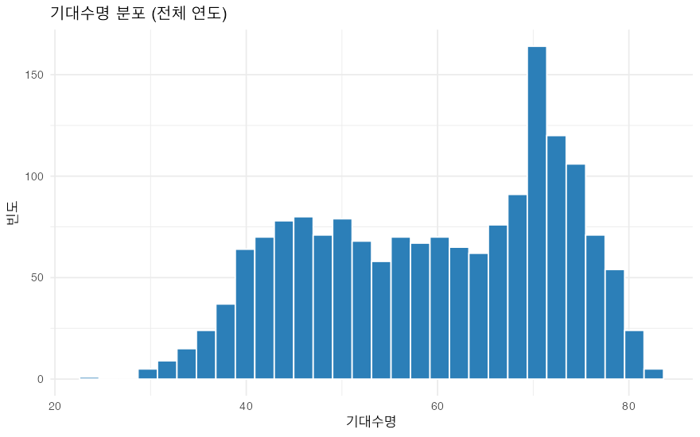
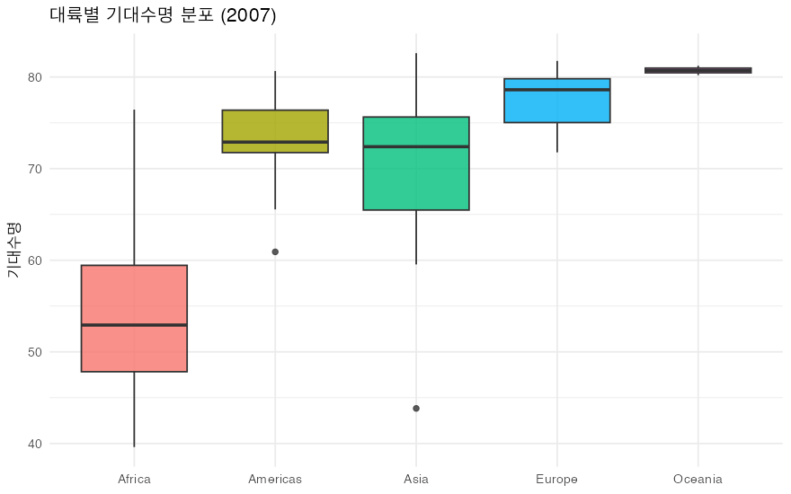
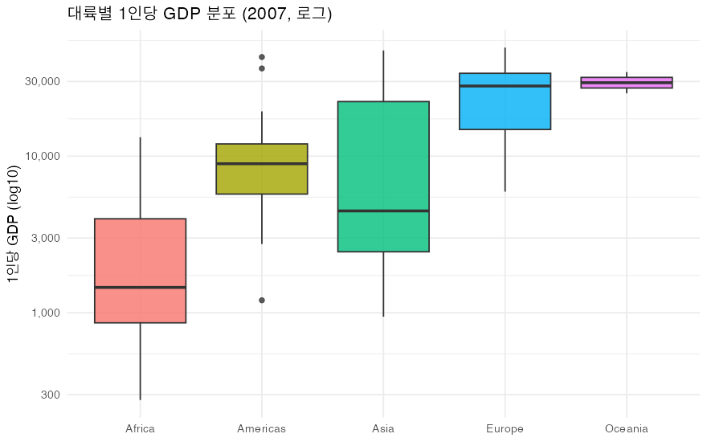
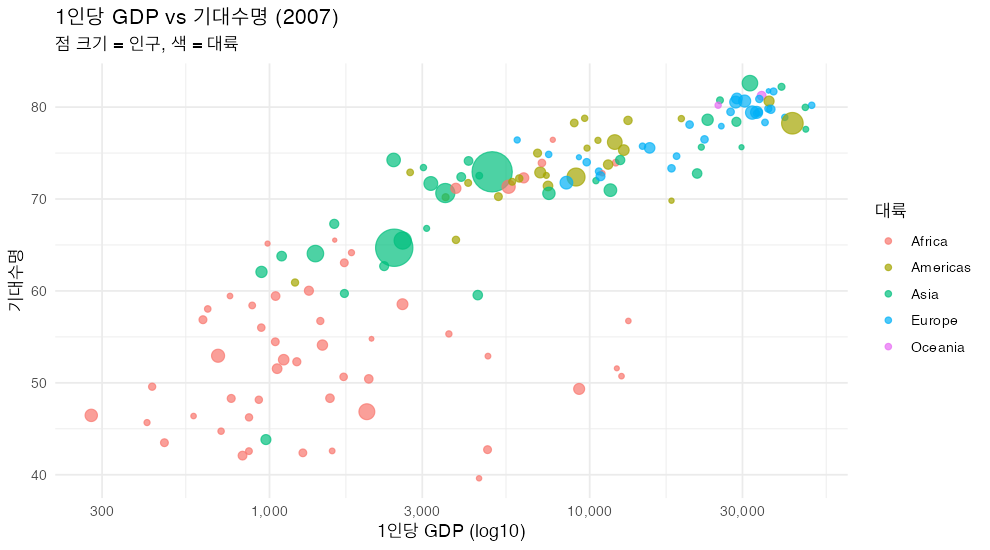
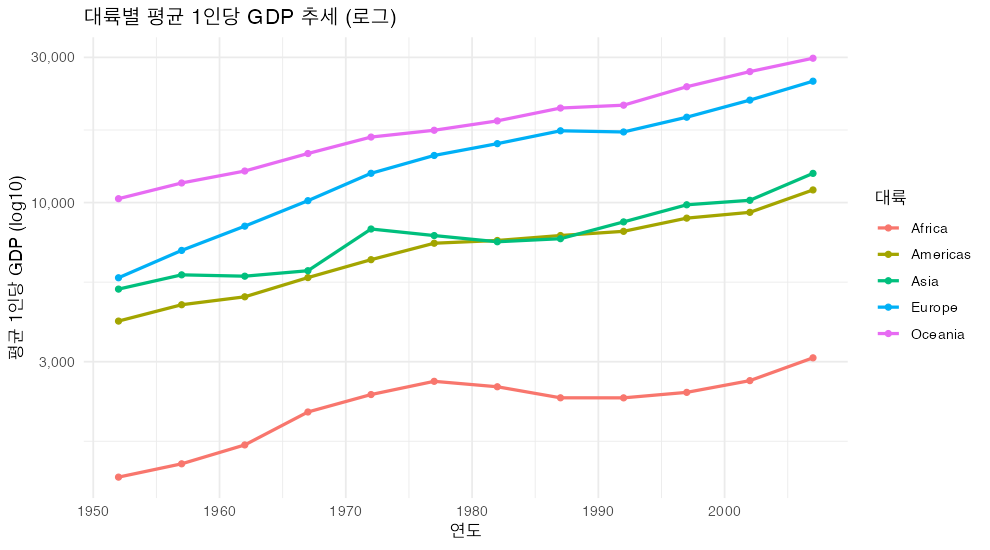

# Gapminder 탐색적 데이터 분석 (EDA)

> 생성: `eda.R` · 대상: `data/gapminder.csv` · 그래프: `figures/`

## 1. 단변량 분포

주요 수치형 변수의 분포 특성입니다. 인구와 1인당 GDP는 강한 우편향(right-skew)을 보여 로그 변환이 권장됩니다.

| 변수 | 평균 | 표준편차 | 왜도(대략) |
|------|-----:|--------:|----------:|
| lifeExp | 59.5 | 12.9 | -0.25 |
| pop | 29,601,212.3 | 106,157,896.7 | 8.33 |
| gdpPercap | 7,215.3 | 9,857.5 | 3.85 |

## 2. 대륙별 분포 비교 (2007년)

| 대륙 | 중앙값 기대수명 | 중앙값 1인당 GDP |
|------|---------------:|----------------:|
| Africa | 52.9 | $1,452 |
| Americas | 72.9 | $8,948 |
| Asia | 72.4 | $4,471 |
| Europe | 78.6 | $28,054 |
| Oceania | 80.7 | $29,810 |

## 3. 소득과 기대수명의 관계

- 상관계수: 원본 **0.584**, 로그(GDP) **0.808**
- 로그 변환 시 선형 관계가 뚜렷해지며, 소득의 한계 수명 효과가 체감함을 시사합니다.

## 4. 시계열 추세

대륙별 평균 기대수명의 1952→2007 변화:

| 대륙 | 1952 | 2007 | 증가폭 |
|------|------:|------:|------:|
| Africa | 39.1 | 54.8 | +15.7 |
| Americas | 53.3 | 73.6 | +20.3 |
| Asia | 46.3 | 70.7 | +24.4 |
| Europe | 64.4 | 77.6 | +13.2 |
| Oceania | 69.3 | 80.7 | +11.5 |

## 5. 특이 케이스

기대수명이 직전 시점 대비 **2세 이상 하락**한 사례 (상위 8건):

| 국가 | 연도 | 변화(세) |
|------|-----:|--------:|
| Rwanda | 1992 | -20.4 |
| Zimbabwe | 1997 | -13.6 |
| Lesotho | 2002 | -11.0 |
| Swaziland | 2002 | -10.4 |
| Botswana | 1997 | -10.2 |
| Cambodia | 1977 | -9.1 |
| Namibia | 2002 | -7.4 |
| South Africa | 2002 | -6.9 |

총 41건의 하락 사례가 관찰되었습니다 (대부분 분쟁·전염병·기근과 연관).

## 6. 종합 인사이트

1. **분포**: 인구·GDP는 강한 우편향 → 분석 시 로그 변환 권장.
2. **격차**: 대륙 간 기대수명·소득 격차가 뚜렷하며 아프리카가 일관되게 최하위.
3. **관계**: log(GDP)와 기대수명은 강한 양의 상관(0.808) — 수확 체감형.
4. **추세**: 모든 대륙에서 기대수명 상승, 단 41건의 역행 사례 존재.
5. **데이터 품질**: 142개국 × 12시점 완전 균형 패널 → 시계열·횡단면 분석에 적합.

> 그래프 원본 파일은 `figures/` 폴더에 있습니다.
